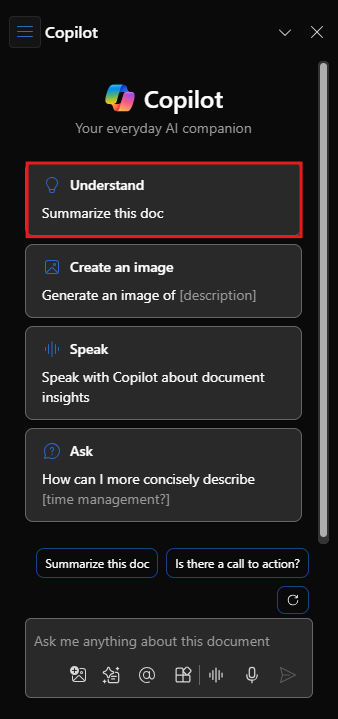

# Semplificare ed estrarre informazioni chiave con Copilot in Word

Per iniziare a usare Microsoft 365 Copilot in Word, è sufficiente aprire il pannello **Copilot** selezionando l'icona Copilot nella scheda **Home** della barra multifunzione.

Questa utile funzionalità fornisce risposte alle domande, generali o specifiche, sul documento. Avere una discussione bidirezionale per reiterare e perfezionare i risultati, ottenere un riepilogo o informazioni specifiche sul contenuto di un documento oppure chiedere di generare idee, tabelle o elenchi che è possibile copiare e inserire nel documento.

Nell'esempio seguente, un prompt di base per Copilot in Word viene trasformato in un prompt contestuale ben strutturato, che fornisce esclusivamente le informazioni necessarie, nel formato richiesto.

## Iniziamo a creare

Prima di tutto, scaricare **_[Market Analysis Report for Mystic Spice Premium Chai Tea.docx](https://go.microsoft.com/fwlink/?linkid=2268826)_** e salvare il file nella **cartella di OneDrive**, se non è ancora stato fatto.

Aprire il documento in Word e quindi aprire il riquadro **Copilot** selezionando la relativa icona nella scheda **Home** della barra multifunzione. Immettere le richieste riportate di seguito e seguire la procedura.

> [!NOTE]
> Richiesta iniziale:
>
> _Riepiloga questo documento di Word._

In questo semplice prompt, si inizia con l'**obiettivo** di base: _riepilogare un documento di Word._ Tuttavia, non sono disponibili informazioni sul motivo per cui il documento deve essere riepilogato o su ciò che è necessario includere nel riepilogo.

| Elemento | Esempio |
| :------ | :------- |
| **Richiesta di base:** iniziare con un **obiettivo** | **Riepiloga questo documento di Word.** |
| **Buona richiesta:** aggiungere **contesto** | L'aggiunta di **Contesto** può aiutare Copilot a comprendere lo scopo del riepilogo e personalizzare la risposta di conseguenza. _"con una breve panoramica dei punti principali da discutere con il team durante la riunione vendite di domani."_ |
| **Richiesta migliore:** specificare le **origini** | L'aggiunta di **origini** può aiutare Copilot a comprendere quale documento o parte devono essere riepilogati, fornendo così una risposta più accurata. _"...la sezione sull'analisi competitiva..."_ |
| **Richiesta ottimale:** impostare **aspettative** chiare | Infine, l'aggiunta di **Aspettative** può aiutare Copilot a comprendere come formattare il riepilogo e quale livello di dettaglio è necessario. _"Struttura il riepilogo su 5 punti chiave e usa un linguaggio semplice."_ |

> [!NOTE]
> **Richiesta creata**:
>
> _Riepiloga la sezione sull'analisi competitiva in questo documento Word con una breve panoramica dei punti principali da discutere con il mio team durante la riunione vendite di domani. Struttura il riepilogo in 5 punti chiave e usa un linguaggio chiaro e semplice._

Questa richiesta contiene tutti i dettagli necessari, ovvero **Obiettivo**, **Contesto**, **Origine** e **Aspettative**, in modo che Copilot possa fornire la risposta che si sta cercando.

## Esplora altro

Provare il prompt finale creato, usando però il proprio documento di Word. Personalizzare il **Contesto**, le **Origini** e le **Aspettative** per ottenere dal documento solo ciò di cui si ha bisogno, evitando informazioni extra non necessarie.

Quali sono gli altri modi che potrebbero essere usati per aggiungere contesto, origini o aspettative al prompt? Quali sono le altre strategie di prompt che è possibile usare per ottenere la risposta desiderata?

> [!IMPORTANT]
> Questa funzionalità è disponibile per i clienti con una licenza di Microsoft 365 Copilot o Copilot Pro. Per altre informazioni, consultare [Ti diamo il benvenuto in Copilot in Word](https://support.microsoft.com/office/welcome-to-copilot-in-word-2135e85f-a467-463b-b2f0-c51a46d625d1).

Nell'unità successiva verrà spiegato come creare prompt simili per Copilot in PowerPoint.
