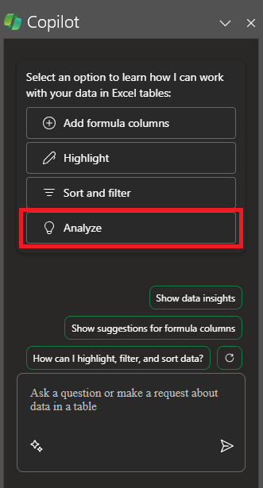

Microsoft 365 Copilot in Excel consente di eseguire altre operazioni con i dati nelle tabelle di Excel generando suggerimenti per le colonne delle formule, visualizzando informazioni dettagliate nei grafici e nelle tabelle pivot ed evidenziando parti interessanti dei dati. 

In Excel selezionare **Copilot**  sulla barra multifunzione per aprire il riquadro della chat. È necessario disporre di una **tabella di Excel** che includa i dati in un foglio di lavoro prima di usare Copilot. 

Seguendo questa procedura è possibile trasformare rapidamente un intervallo di celle in una tabella Excel: 

1. Selezionare la cella o l'intervallo nei dati.

1. Selezionare **Home > Formatta come tabella**.

1. Nella finestra di dialogo  **Formatta come tabella**  selezionare la casella di controllo accanto a  **Tabella personale con intestazioni**  se si desidera che la prima riga dell'intervallo sia la riga di intestazione.

1. Selezionare **OK**.

## Iniziamo a creare

Iniziare scaricando il file **_[Contoso Chai Tea market trends 2023.xlsx](https://go.microsoft.com/fwlink/?linkid=2268822)_** e salvandolo nella propria **cartella OneDrive** se non è ancora stato fatto.

Aprire il foglio di calcolo in Excel e il riquadro **Copilot** selezionando la relativa icona nella scheda **Home** della barra multifunzione. Immettere le richieste riportate di seguito e seguire la procedura.

> [!NOTE]
> Richiesta iniziale:
>
> _Analizzare questa tabella in Excel._

In questa semplice richiesta si parte dall'**obiettivo** di base: _analizzare una tabella Excel._ Tuttavia, non sono disponibili informazioni sul motivo per cui la tabella deve essere riepilogata o per che cosa è necessario il riepilogo.

| Elemento | Esempio |
| :------ | :------- |
| Richiesta di base:  Iniziare da un **Obiettivo** | **Analizzare questa tabella in Excel.** |
| Buona richiesta:  Aggiungere **Contesto** | L'aggiunta di **contesto** consente a Copilot di comprendere lo scopo dell'analisi e di regolare di conseguenza la risposta.  "_Stiamo cercando i prodotti più venduti da maggio ad agosto per orientare la nostra strategia di marketing per il prossimo anno._" |
| Richiesta migliore:  Specificare la/le **Fonte/i** | L'aggiunta di **origini** può aiutare Copilot a restringere l'ambito indicandogli di usare informazioni o intervalli specifici.  "_...da maggio ad agosto..._" |
| Richiesta ottimale:  Impostare delle **Aspettative** chiare | Infine, l'aggiunta di **Aspettative** può aiutare Copilot a comprendere come formattare il riepilogo e quale livello di dettaglio è necessario.  "_Evidenziare il prodotto più venduto su base mensile_" |

> [!NOTE]
> **Richiesta creata**:
>
> _Analizzare questa tabella di Excel. Stiamo cercando i prodotti più venduti da maggio ad agosto per orientare la nostra strategia di marketing per il prossimo anno. Evidenziare il mese del prodotto più venduto su base mensile._

Questo prompt fornisce a Copilot tutte le informazioni necessarie per elaborare una buona risposta, compresi gli elementi di **Obiettivo**, **Contesto**, **Origine** e **Aspettative**.

## Esplora altro

Provare la richiesta finale creata e altre con la propria tabella di Excel. Ecco alcuni suggerimenti per altre richieste che è possibile provare. Copiarle e aggiungere **contesto**, **origini** e **aspettative**.  

- Tracciare le vendite per categoria nel tempo.

- Mostrare le vendite totali per ogni prodotto.

- Mostrare il totale delle vendite pubblicitarie per ogni area nell'anno precedente.

> [!IMPORTANT]
> Questa funzionalità è disponibile per i clienti con una licenza di Copilot per Microsoft 365 o Copilot Pro. Per altre informazioni sulle tabelle di Excel e su come crearle, consultare [Creare una tabella in Excel](https://support.microsoft.com/office/bf0ce08b-d012-42ec-8ecf-a2259c9faf3f). 