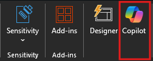
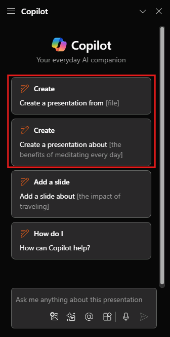

# Creare nuove diapositive, agende ed elenchi attività con Microsoft 365 Copilot in PowerPoint

Microsoft 365 Copilot in PowerPoint è una funzionalità basata sull'intelligenza artificiale che consente di creare, progettare e formattare le diapositive.  Puoi digitare ciò che intendi trasmettere con la presentazione e Copilot ti aiuta a farlo.

Copilot può aiutarti a compilare la diapositiva vuota iniziale e a procedere nella giusta direzione. Per iniziare a usare Copilot in PowerPoint, è possibile aprire il riquadro **Copilot** tramite l'icona Copilot nella scheda **Home** della barra multifunzione.

Dal riquadro Copilot è possibile iniziare a creare una nuova presentazione da un documento di Word o su un argomento desiderato. Nell'esempio si inizia con la richiesta di base di creare una presentazione su un argomento e si aggiungono altri elementi per rendere la richiesta più efficace.

> [!TIP]
> Attualmente, Copilot in PowerPoint è in grado di creare presentazioni solo a partire da documenti di Word.

## Iniziamo a creare

Se non è ancora stato fatto, scaricare i file seguenti e salvarli nella **cartella OneDrive** in modo che vengano visualizzati nell'elenco dei file usati di recente:

- **_[Market Trend Report- Protein shake.docx](https://go.microsoft.com/fwlink/?linkid=2268827)_**

> [!NOTE]
> Richiesta iniziale:
>
> _Crea una nuova presentazione in PowerPoint._

In questa semplice richiesta, si parte dall'**obiettivo** di base: _creare una nuova presentazione in PowerPoint._ Tuttavia, non sono disponibili informazioni sui contenuti della presentazione o sull'aspetto che dovrebbe avere.

| Elemento | Esempio |
| :------ | :------- |
| **Richiesta di base:** iniziare con un **obiettivo** | **_Crea una nuova presentazione in PowerPoint._** |
| **Buona richiesta:** aggiungere **contesto** | L'aggiunta di **Contesto** consente a Copilot di comprendere il tipo di documento da creare e il relativo utilizzo. _"Dobbiamo presentare le caratteristiche e i vantaggi del prodotto ai potenziali clienti."_ |
| **Richiesta migliore:** specificare le **origini** | Aggiungendo le **Origini** si può aiutare Copilot a capire dove cercare informazioni specifiche. _"...utilizzando la versione più recente di **/Market Trend Report- Protein shake.docx**."_ |
| **Richiesta ottimale:** impostare **aspettative** chiare | Infine, l'inclusione di **Aspettative** può aiutare Copilot a comprendere lo stile e la formattazione desiderati per il documento. _"Includi una panoramica del prodotto, le sue caratteristiche e i vantaggi chiave e un confronto con prodotti simili sul mercato. Usa un linguaggio semplice."_ |

> [!NOTE]
> **Richiesta creata**:
>
> _Crea una nuova presentazione di PowerPoint usando la versione più recente di **/Market Trend Report- Protein shake.docx**. È necessario presentare le caratteristiche e i vantaggi del prodotto alla clientela potenziale. Includi una panoramica del prodotto, le caratteristiche e i vantaggi chiave e un confronto con prodotti simili sul mercato. Usa un linguaggio semplice._

Con l'indicazione dell'**obiettivo**, **del contesto**, **della fonte** e delle **aspettative**, Copilot ha tutto il necessario per dare un'ottima risposta.

### Riferimenti alle fonti

Come nell'esempio, se si vuole che Copilot basi la nuova presentazione su un file già presente, è possibile comunicarlo perché venga effettuato. Nella finestra della richiesta selezionare **Crea presentazione dal file** per scegliere **_fino a 3 file_** che Copilot deve esaminare durante la creazione del nuovo documento.

Nella casella di composizione è anche possibile immettere "/" e il nome del file a cui si vuole fare riferimento, aggiornando le opzioni dei file visualizzate nel menu di selezione.

> [!IMPORTANT]
> È necessario disporre dell'autorizzazione per accedere ai file a cui si fa riferimento, indipendentemente dal fatto che si trovino in SharePoint o OneDrive dell'organizzazione e possano essere file di Word o PowerPoint.

### Procedure consigliate per la creazione di una presentazione da un documento di Word

Sfruttare **gli stili di Word** per aiutare Copilot a comprendere la struttura del documento. Usando gli **stili** in Word per organizzare il documento, Copilot comprenderà meglio la struttura del documento e come suddividerla nelle diapositive di una presentazione. Strutturare il contenuto in **titoli** e **intestazioni**, qualora opportuno, e Copilot creerà una presentazione al meglio delle sue capacità.

### Includere immagini rilevanti per la presentazione

Durante la creazione di una presentazione, Copilot tenterà di incorporare le immagini nel documento di Word. Se si dispone di immagini che si vuole siano presenti nella presentazione, assicurarsi di includerle nel documento di Word.

### Iniziare con il modello dell'organizzazione

Se l'organizzazione usa un modello standard, iniziare con questo file prima di creare una presentazione con Copilot. Iniziando con un modello, Copilot saprà che si desidera mantenere il tema e il design della presentazione. Copilot userà layout esistenti per creare una presentazione.

> [!IMPORTANT]
> Questa funzionalità è disponibile per i clienti con una licenza di Microsoft 365 Copilot o Copilot Pro. Per ulteriori informazioni, consultare [Creare una presentazione da un file con Copilot](https://support.microsoft.com/office/create-a-new-presentation-3222ee03-f5a4-4d27-8642-9c387ab4854d).
