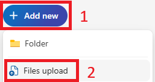

# Esercizio - Seguire l'uso di dati di esempio con Microsoft 365 Copilot

In questo modulo verranno create richieste per Microsoft 365 Copilot che fanno riferimento a questi file:

- [Graphic Design Institute - Employee Benefits.docx](https://go.microsoft.com/fwlink/?linkid=2268825)
- [Mystic Spice Premium Chai Market Analysis Presentation.pptx](https://go.microsoft.com/fwlink/?linkid=2268768)
- [Campagne di marketing Fabrikam Q1.xlsx](https://go.microsoft.com/fwlink/?linkid=2269124)

**Nota**: questi sono i file a cui faremo riferimento in tutto il modulo. Per questo lab, tuttavia, si inizierà caricando tutti i file in **OneDrive** per assicurarsi che siano accessibili per le richieste di Copilot in un secondo momento.

## Caricare i file in OneDrive

> [!IMPORTANT]
> È possibile ignorare questo passaggio se tutti i file sono già stati caricati dalla cartella **"C:\ResourceFiles"** su **OneDrive**. 

Seguire questa procedura per caricare tutti i file necessari in **OneDrive**:

1. Accedere alla macchina virtuale fornita dal provider del tenant come account **Amministratore** locale con la password `Pa55w.rd`.
2. Sulla barra delle applicazioni di Windows, selezionare **Microsoft Edge**.
3. Nella barra degli indirizzi, immettere `https://onedrive.live.com/login`.
4. In **Ti diamo il benvenuto in Microsoft 365**, selezionare **Accedi**.
5. Nella **richiesta di accesso**, immettere `userx@yourtenant.onmicrosoft.com` (nome utente e tenant fornito dal tenant specificato) e selezionare **Avanti**.

    

6. Nella schermata**Immettere la password**, immettere la password (fornita dal provider del tenant) per l'account utente e quindi selezionare **Accedi**.
7. Se viene richiesto se **Rimanere connessi?**, selezionare **Non visualizzare più quetsto messaggio** e quindi **Sì**.
8. In **OneDrive**, nell'angolo in alto a sinistra, selezionare **+** (aggiungi nuovo) > **Caricamento file**.

    

9. In **Esplora file**, selezionare **Questo PC** > **Disco locale (C:)** e aprire la cartella **ResourceFiles**.
10. Selezionare tutti i file all'interno della cartella **ResourceFiles**, quindi selezionare **Apri** per caricarli in **OneDrive**.
11. Al termine del caricamento, nella parte inferiore della schermata dovrebbe essere visualizzato **29 elementi caricati in I miei file**.
12. Lasciare aperto **Edge** e passare all'attività successiva.

### Riferimento ai file

Quando si fa riferimento ai file da Copilot, è possibile che alcuni file non vengano trovati tra quelli suggeriti. A volte questo accade perché alcune esperienze con Copilot fanno riferimento solo ai file dall'elenco Usati di recente (MRU), mentre altre consentono di esplorare OneDrive per trovare il file. Aggiungerli a tale elenco è semplice come aprirli nell'app di Microsoft 365 appropriata.  Una volta aperti, dovrebbero essere visualizzati nell'elenco dei file usati di recente.

> [!IMPORTANT]
> Microsoft 365 Copilot funzionerà solo con i file salvati in OneDrive. Se i file sono archiviati localmente nel PC, dovranno essere spostati in OneDrive per attivare Copilot.

Procedendo all'interno del modulo, si avrà l'opportunità di provare altri prompt su questi file e si consiglia di farlo per esplorare e migliorare le proprie competenze nell'ambito dei prompt.
