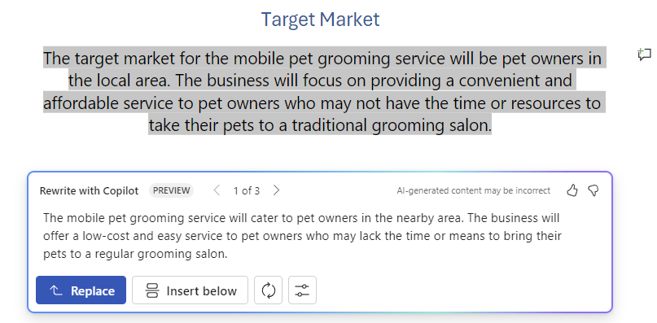
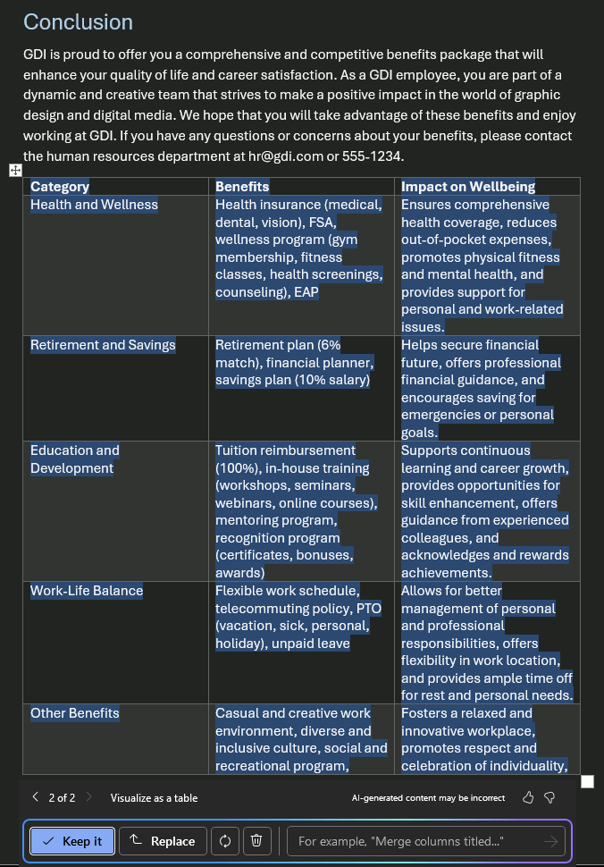

# Scrivere, organizzare e trasformare i contenuti usando Microsoft 365 Copilot in Word

Microsoft 365 Copilot in Word consente di rimanere nel flusso di idee durante la stesura di nuovi contenuti e trasformare il contenuto dopo aver scritto le proprie idee. Copilot può riscrivere il testo e anche regolarne il tono. Copilot può anche trasformare il testo in una tabella modificabile. Seguire la procedura per trasformare il contenuto in Word:

## Riscrivere per il tono

1. Selezionare il testo che si desidera far convertire a Copilot.

1. Nel margine sinistro, accanto al testo, selezionare l'icona **Copilot**.

1. Nel menu Copilot a margine sinistro selezionare **Riscrivi**.

1. Copilot mostra le opzioni riscritte tra cui scegliere.

1. Selezionare **Sostituisci** per usare il testo modificato, **Inserisci sotto** per inserire il testo riscritto sotto il testo corrente, **Rigenera** per rigenerare i suggerimenti di Copilot o **Regola il tono** per regolare il testo riscritto dandogli il tono desiderato.

    

## Da testo a tabella

1. Selezionare il testo che Copilot deve convertire in una tabella.

1. Nel margine sinistro, accanto al testo, selezionare l'icona **Copilot**.

1. Nel margine sinistro, nel menu Copilot selezionare **Visualizza come tabella**.

1. Copilot mostra l'aspetto della tabella.

1. Selezionare **Mantieni** per inserire la tabella nel documento, **Rigenera** per rigenerare la tabella di Copilot o **Rimuovi** per rimuovere la tabella.

1. Per ottimizzare la tabella, immettere i dettagli nel riquadro di composizione di Copilot per indicare cosa modificare nella tabella.

    1. La modifica della formattazione di una tabella non è supportata nel riquadro di composizione, ma la formattazione della tabella può essere modificata usando le opzioni della tabella nella barra multifunzione di Word.

    

Nell'esempio seguente si inizia con una semplice richiesta di trasformare un testo in una tabella e aggiungere elementi durante il procedimento. Seguire l'esempio usando i propri dati.

## Iniziamo a creare

Prima di tutto, scaricare **_[Graphic Design Institute - Employee Benefits.docx](https://go.microsoft.com/fwlink/?linkid=2268825)_** e salvare il file nella **cartella di OneDrive**, se non è ancora stato fatto.

Aprire il documento in Word ed evidenziare tutto il testo del documento (premere **CTRL+A**). Nel margine sinistro, nel menu Copilot selezionare **Visualizza come tabella**. Dopo aver generato la tabella, usare le istruzioni riportate di seguito per perfezionare i risultati di Copilot.

> [!NOTE]
> Richiesta iniziale:
>
> _Visualizza come tabella_.

In questa semplice richiesta, iniziare con l'**Obiettivo** di base: _trasformare il testo in una tabella._ Tuttavia, non esiste alcuna indicazione delle informazioni desiderate nella tabella o del motivo per cui deve essere una tabella.

| Elemento | Esempio |
| :------ | :------- |
| **Richiesta di base:** iniziare con un **obiettivo** | **_Visualizza come tabella._** |
| **Buona richiesta:** aggiungere **contesto** | L'aggiunta di **Contesto** consente a Copilot di comprendere il tipo di dati da visualizzare e per cosa verranno usati. _"Abbiamo bisogno di un modo chiaro per comunicare questi vantaggi ai potenziali dipendenti."_ |
| **Richiesta migliore:** specificare le **origini** | In questo esempio, l'**Origine** è l'intero testo di **Graphic Design Institute - Employee Benefits.docx**. |
| **Richiesta ottimale:** impostare **aspettative** chiare | Infine, l'aggiunta di **Aspettative** può aiutare Copilot a comprendere come si vuole organizzare e scrivere la tabella. _"Includi una terza colonna che descrive chiaramente i vantaggi per i dipendenti e come questo influisca sul loro benessere."_ |

> [!NOTE]
> **Richiesta creata**:
>
> _Visualizza come tabella. Abbiamo bisogno di un modo chiaro per comunicare questi vantaggi ai potenziali dipendenti. Includi una terza colonna che descrive chiaramente l vantaggi per i dipendenti e come questi influiscano sul loro benessere._

Questo prompt fornisce a Copilot tutte le informazioni necessarie per elaborare una buona risposta, compresi gli elementi di **Obiettivo**, **Contesto**, **Origine** e **Aspettative**.

> [!IMPORTANT]
> Questa funzionalità è disponibile per i clienti con una licenza di Microsoft 365 Copilot o Copilot Pro. Per altre informazioni, vedere [Trasformare il contenuto con Copilot in Word](https://support.microsoft.com/office/transform-your-content-with-copilot-in-word-923d9763-f896-4da7-8a3f-5b12c3bfc475).
