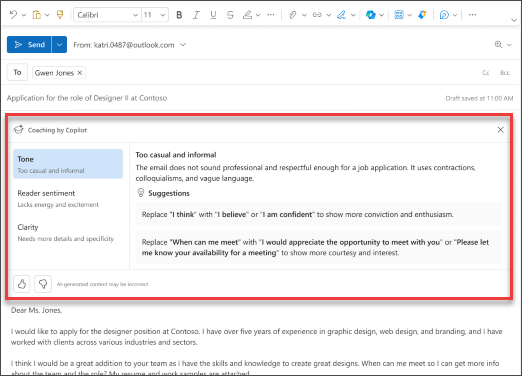

Devi scrivere un messaggio di posta elettronica importante e vuoi avere la certezza che comunichi efficacemente il contenuto desiderato? Con Copilot in Outlook, è possibile ottenere suggerimenti utili su come regolare il tono, sulla chiarezza e sulla valutazione del lettore prima dell'invio. 

1. In Outlook selezionare **Home > Nuovo > Posta**. Digitare il messaggio di posta elettronica. 

1. Selezionare l'icona **Copilot** dalla barra degli strumenti. Scegliere **Coaching di Copilot** dal menu a discesa.

    

1. Copilot esamina la posta elettronica e offre suggerimenti per migliorare il tono, la chiarezza e la valutazione del lettore.

1. Se si accetta un solo suggerimento o tutti, incorporare il feedback nella bozza. Quando si è soddisfatti del risultato, inviare il messaggio di posta elettronica.

    

Nell'esempio seguente, si parte da un prompt di base a cui vengono progressivamente aggiunti ulteriori elementi. Seguire l'esempio usando il proprio messaggio di posta elettronica.

## Iniziamo a creare

> [!NOTE]
> Richiesta iniziale:
>
> _Rivedi questo messaggio di posta elettronica e fornisci suggerimenti per eventuali miglioramenti._

In questo semplice prompt, si inizia con l'**obiettivo** di base: _rivedere un messaggio di posta elettronica per i miglioramenti._ Come si può notare, le informazioni di partenza sono piuttosto limitate.

| Elemento | Esempio |
| :------ | :------- |
| Richiesta di base:  Iniziare da un **Obiettivo** | **_Rivedi questo messaggio di posta elettronica e fornisci suggerimenti per eventuali miglioramenti._** |
| Buona richiesta:  Aggiungere **Contesto** | L'inclusione del **Contesto** permette a Copilot di comprendere l'intento del messaggio di posta elettronica e i miglioramenti che si desidera ottenere.  “..._per il nostro cliente e fornire suggerimenti per migliorare la sua chiarezza e professionalità_." |
| Richiesta migliore:  Specificare la/le **Fonte/i** | Si presume che l'**Origine** di questo prompt sia il messaggio di posta elettronica attualmente in scrittura su Outlook.  "..._questo messaggio di posta elettronica_." |
| Richiesta ottimale:  Impostare delle **Aspettative** chiare | Infine, l'inclusione di **Aspettative** può aiutare Copilot a capire come si desidera che la tabella appaia e venga interpretata.  "_Proponi modifiche all'oggetto, al saluto, al corpo del testo e alla chiusura del messaggio di posta elettronica, garantendo che sia conciso, privo di errori e mantenga un tono professionale_." |

> [!NOTE]
> **Richiesta creata**:
>
> _Rivedi questo messaggio di posta elettronica per il nostro cliente e fornisci suggerimenti per migliorarne chiarezza e professionalità. Proponi modifiche all'oggetto, al saluto, al corpo del testo e alla chiusura del messaggio di posta elettronica, garantendo che sia conciso, privo di errori e mantenga un tono professionale._

Questo prompt fornisce a Copilot tutte le informazioni necessarie per elaborare una buona risposta, compresi gli elementi di **Obiettivo**, **Contesto**, **Origine** e **Aspettative**.

## Esplora altro

> [!IMPORTANT]
> Il coaching con Copilot è attualmente disponibile in Outlook per Windows, Outlook sul Web e Outlook.com.
> Attualmente, Copilot in Outlook supporta esclusivamente account aziendali o dell'istituto di istruzione, oltre agli account Microsoft con indirizzi email che terminano in outlook.com, hotmail.com, live.com e msn.com. Gli account Microsoft associati a provider di posta elettronica di terze parti, come Gmail, Yahoo o iCloud, possono comunque usare Outlook, ma non avranno accesso alle funzionalità di Copilot. Per altre informazioni, consultare **[Coaching tramite posta elettronica con Copilot in Outlook](https://support.microsoft.com/office/email-coaching-with-copilot-in-outlook-91a3cd56-1586-4a31-85c7-2eb8cdb02405#OSVersion=iOS)**.