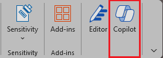

Per chattare con Copilot in Word, aprire il riquadro **Copilot** selezionando l'icona Copilot nella scheda **Home** della barra multifunzione. 

Oltre a creare contenuti o generare idee, Copilot in Word è in grado di rispondere alle domande sul documento che si sta leggendo. Quando Copilot risponde alla richiesta dell'utente, è anche possibile visualizzare i riferimenti con citazioni da cui Copilot ha estratto le informazioni nel documento.

## Porre domande su questo documento

- Riepilogare questo documento: è necessario ricavare rapidamente le idee fondamentali del documento? Digitare Riepiloga questo documento nel riquadro chat di Copilot per ricavare un riepilogo puntato del documento.

- C'è un invito all'azione? - Chiedersi se il documento contiene un invito significativo all'azione. Chiedere a Copilot e tenterà di dirlo.

## Fare domande aperte

Si desidera aggiungere dei contenuti o contesti al documento? Fare domande generali a Copilot e proverà a rispondere. Ad esempio: 

- Come è possibile modificare questo documento per farlo sembrare più accademico?

- C'è una citazione del Presidente degli Stati Uniti sul coraggio?

Se tali risposte non sono presenti nel documento, Copilot genera contenuti usando i modelli linguistici di grandi dimensioni sottostanti. Se si trova un elemento desiderato e si vuole aggiungere al documento, è sufficiente copiarlo e incollarlo dal riquadro Copilot nel documento.

## Iniziamo a creare

Prima di tutto, scaricare **_[Market Analysis Report for Mystic Spice Premium Chai Tea.docx](https://go.microsoft.com/fwlink/?linkid=2268826)_** e salvare il file nella **cartella di OneDrive**, se non è ancora stato fatto.

Aprire il documento in Word e quindi aprire il riquadro **Copilot** selezionando la relativa icona nella scheda **Home** della barra multifunzione. Immettere le richieste riportate di seguito e seguire la procedura.

> [!NOTE]
> Richiesta iniziale:
>
> _C'è un invito all'azione?_

In questa semplice richiesta, si parte dall'**obiettivo** di base: _trovare un invito significativo all'azione nel documento._ Tuttavia, non è stato ancora spiegato _perché_ sono richieste queste informazioni.

| Elemento | Esempio |
| :------ | :------- |
| Richiesta di base:  Iniziare da un **Obiettivo** | **_C'è un invito all'azione?_** |
| Buona richiesta:  Specificare la/le **Fonte/i** | L'aggiunta di **Origini** può aiutare Copilot a cercare informazioni specifiche.  "_... in questo rapporto di analisi del mercato..._" |
| Richiesta migliore:  Aggiungere **Contesto** | L'aggiunta di **contesto** consente a Copilot di offrire una risposta più personalizzata tenendolo in considerazione.  "_... per affrontare le nostre sfide e preoccupazioni. Verificare se il piano di marketing include un piano d'azione chiaro e specifico, ad esempio un piano promozionale o uno sconto per un periodo di tempo limitato._" |
| Richiesta ottimale:  Impostare delle **Aspettative** chiare | Infine, l'aggiunta di **aspettative** può aiutare Copilot a capire cosa è esattamente necessario, invece di fornire solo una semplice risposta _affermativa_ o _negativa_.  "_Fornire suggerimenti per migliorare l'invito all'azione, se necessario._" |

> [!NOTE]
> **Richiesta creata**:
>
> _C'è un invito all'azione in questa relazione di analisi del mercato per affrontare le nostre sfide e preoccupazioni? Verificare se il piano di marketing include un piano d'azione chiaro e specifico, ad esempio un piano promozionale o uno sconto a tempo limitato. Se necessario, fornire suggerimenti per migliorare l'invito all'azione._

Questo prompt fornisce a Copilot tutte le informazioni necessarie per elaborare una buona risposta, compresi gli elementi di **Obiettivo**, **Contesto**, **Origine** e **Aspettative**.

> [!IMPORTANT]
> Questa funzionalità è disponibile per i clienti con una licenza di Microsoft 365 Copilot o Copilot Pro. Per ulteriori informazioni, consultare [Chattare con Copilot sul proprio documento Word](https://support.microsoft.com/office/chat-with-copilot-about-your-word-document-4482c688-a495-4571-bfcd-4a9fc6608090).
