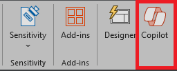

Per iniziare a chattare con Copilot in PowerPoint, aprire il riquadro **Copilot** selezionando l'icona Copilot nella scheda **Home** della barra multifunzione.

Durante la creazione di una presentazione, è possibile che non si abbia la certezza di come organizzare le diapositive in sezioni. Copilot in PowerPoint può essere utile. È possibile chiedere a Copilot di organizzare la presentazione. Le organizza in sezioni e quindi aggiunge le diapositive dell'intestazione di sezione. 

1. Selezionare il pulsante Copilot nella barra multifunzione.

1. Sul lato destro della schermata, si apre un riquadro Copilot.

1. Digitare **Organizza questa presentazione** nel campo della richiesta nella parte inferiore del riquadro Copilot.

1. Selezionare **Invia**.

Se quello che fa Copilot non piace, è possibile semplicemente selezionare il **pulsante Annulla** sulla barra multifunzione per ripristinare lo stato precedente della raccolta. 

## Iniziamo a creare

Se non è ancora stato fatto, scaricare i file seguenti e salvarli nella **cartella OneDrive** in modo che vengano visualizzati nell'elenco dei file usati di recente:

- **_[Mystic Spice Premium Chai Market Analysis Presentation.pptx](https://go.microsoft.com/fwlink/?linkid=2268768)_**
- **_[Mystic Spice Premium Chai Tea product description.docx](https://go.microsoft.com/fwlink/?linkid=2268929)_**

> [!NOTE]
> Richiesta iniziale:
>
> _Organizzare questa presentazione in PowerPoint._

In questa semplice richiesta, si inizia con l'**obiettivo** di base: _organizzare una presentazione di PowerPoint_. Tuttavia, non sono disponibili informazioni sul motivo per cui la presentazione deve essere riepilogata o sullo scopo del riepilogo.

| Elemento | Esempio |
| :------ | :------- |
| Richiesta di base:  Iniziare da un **Obiettivo** | **Organizzare questa presentazione in PowerPoint.** |
| Buona richiesta:  Aggiungere **Contesto** | Aggiungendo **Contesto** si può aiutare Copilot a capire come si vuole organizzare la presentazione e perché.  "_per una revisione esecutiva del prodotto la prossima settimana_" |
| Richiesta migliore:  Specificare la/le **Fonte/i** | Aggiungendo le **origini** è possibile aiutare Copilot ad eseguire una ricerca in una posizione specifica, ad esempio nelle specifiche di prodotto o in un catalogo.  "_Fare riferimento a **/Mystic Spice Premium Chai Tea product description.docx** per informazioni sul prodotto._" |
| Richiesta ottimale:  Impostare delle **Aspettative** chiare | Infine, aggiungendo le **Aspettative** si può aiutare Copilot a capire come strutturare la presentazione e il livello di dettaglio da includere.  "_Disporre le diapositive per prodotto e includere una panoramica, un elenco di caratteristiche e vantaggi chiave, il feedback dei clienti e un confronto con prodotti simili sul mercato._" |

> [!NOTE]
> **Richiesta creata**:
>
> _Organizzare questa presentazione per una revisione esecutiva del prodotto la prossima settimana. Per informazioni sul prodotto, fare riferimento a **/Mystic Spice Premium Chai Tea product description.docx**. Disporre le diapositive per prodotto e includere una panoramica, un elenco di caratteristiche e vantaggi chiave, il feedback dei clienti e un confronto con prodotti simili sul mercato._

In questa richiesta vengono forniti l'**Obiettivo**, il **Contesto**, la **Fonte** e le **Aspettative**, offrendo a Copilot istruzioni sufficienti per generare una risposta che soddisfi le proprie esigenze.

## Esplora altro

Provare la richiesta finale usando la propria presentazione di PowerPoint Personalizzare il **Contesto**, le **Fonti** e le **Aspettative** in modo da ottenere ciò di cui si ha bisogno dalla presentazione, senza elementi aggiuntivi non necessari.

> [!IMPORTANT]
> Questa funzionalità è disponibile per i clienti con una licenza di Microsoft 365 Copilot o Copilot Pro. Per altre informazioni, consultare [Organizzare questa presentazione con Copilot in PowerPoint](https://support.microsoft.com/office/organize-this-presentation-with-copilot-in-powerpoint-a207eea3-7a56-4225-88f1-54dd37cdcf6a).